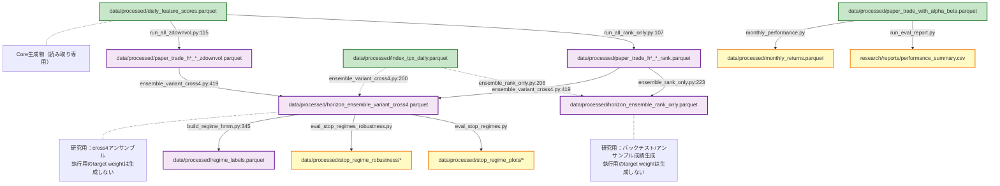
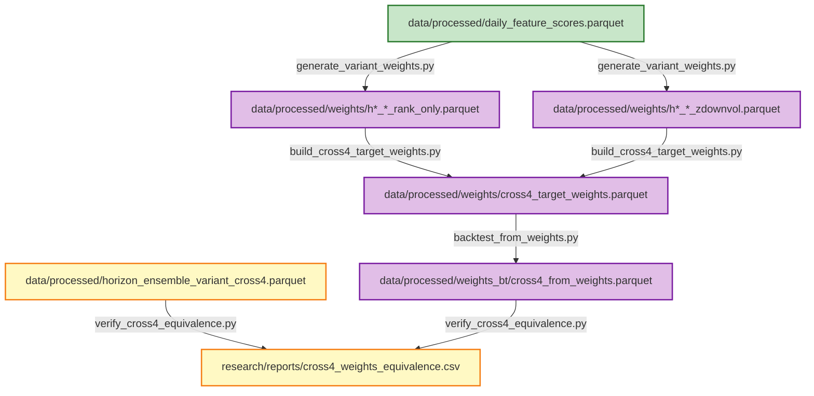

# Analysis研究フロー（検証・評価・研究）

## 概要

analysis側の研究フロー（core生成物を読み込んで研究用parquetを生成）を証拠行付きで可視化します。

**重要**: analysis側はcore生成物を読み込むだけ（書き戻し禁止）。coreへ書き戻し（生成物をcoreが読む）は禁止。

---

## Analysis研究フロー図（Mermaid）

---

## 証拠行（コード位置）

### 1. run_all_rank_only.py

- **入力読み込み**: `daily_feature_scores.parquet`（`horizon_ensemble.py`経由）
- **出力保存**: [`scripts/analysis/run_all_rank_only.py:107`](scripts/analysis/run_all_rank_only.py#L107) (`df_pt.to_parquet(pt_path, index=False)`)
- **出力**: `data/processed/paper_trade_h*_*_rank.parquet`

### 2. run_all_zdownvol.py

- **入力読み込み**: `daily_feature_scores.parquet`（`horizon_ensemble.py`経由）
- **出力保存**: [`scripts/analysis/run_all_zdownvol.py:115`](scripts/analysis/run_all_zdownvol.py#L115) (`df_pt.to_parquet(pt_path, index=False)`)
- **出力**: `data/processed/paper_trade_h*_*_zdownvol.parquet`

### 3. ensemble_rank_only.py

- **入力読み込み**: [`scripts/analysis/ensemble_rank_only.py:80`](scripts/analysis/ensemble_rank_only.py#L80) (`df = pd.read_parquet(alpha_path)`)
- **入力読み込み**: [`scripts/analysis/ensemble_rank_only.py:86`](scripts/analysis/ensemble_rank_only.py#L86) (`df_pt = pd.read_parquet(pt_path)`)
- **TOPIX入力読み込み**: [`scripts/analysis/ensemble_rank_only.py:206`](scripts/analysis/ensemble_rank_only.py#L206) (`df_tpx = pd.read_parquet(tpx_path)`)
- **出力保存**: [`scripts/analysis/ensemble_rank_only.py:223`](scripts/analysis/ensemble_rank_only.py#L223) (`df_merged.to_parquet(out_path, index=False)`)
- **出力**: `data/processed/horizon_ensemble_rank_only.parquet`

### 4. ensemble_variant_cross4.py

- **入力読み込み**: [`scripts/analysis/ensemble_variant_cross4.py:120`](scripts/analysis/ensemble_variant_cross4.py#L120) (`df = pd.read_parquet(alpha_path)`)
- **入力読み込み**: [`scripts/analysis/ensemble_variant_cross4.py:125`](scripts/analysis/ensemble_variant_cross4.py#L125) (`df_pt = pd.read_parquet(pt_path)`)
- **出力保存**: [`scripts/analysis/ensemble_variant_cross4.py:419`](scripts/analysis/ensemble_variant_cross4.py#L419) (`merged.to_parquet(output_path, index=False)`)
- **出力**: `data/processed/horizon_ensemble_variant_cross4.parquet`

### 5. build_regime_hmm.py

- **入力読み込み**: [`scripts/core/build_regime_hmm.py:58`](scripts/core/build_regime_hmm.py#L58) (`df_cross4 = pd.read_parquet(cross4_path)`)
- **入力読み込み**: [`scripts/core/build_regime_hmm.py:75`](scripts/core/build_regime_hmm.py#L75) (`df = pd.read_parquet(alpha_path)`)
- **出力保存**: [`scripts/core/build_regime_hmm.py:345`](scripts/core/build_regime_hmm.py#L345) (`df_result.to_parquet(output_path, index=False)`)
- **出力**: `data/processed/regime_labels.parquet`

---

## 位置づけの明確化

### cross4系スクリプト（研究用）

以下のスクリプトは **研究用：バックテスト/アンサンブル成績生成** であり、**執行用のtarget weightは生成しない**：

- `scripts/analysis/run_all_rank_only.py` - rank-onlyバックテスト実行
- `scripts/analysis/run_all_zdownvol.py` - z_downvol (Variant E) バックテスト実行
- `scripts/analysis/ensemble_rank_only.py` - rank-onlyアンサンブル生成
- `scripts/analysis/ensemble_variant_cross4.py` - cross4アンサンブル生成

**重要:**
- これらはcoreに依存して良い（core生成物を読み込む）
- **coreへ書き戻し（生成物をcoreが読む）は禁止**
- 執行用のtarget weightは生成しない

---

## core→analysis依存関係

### 許可される依存

- ✅ **analysis → core**: OK（analysisがcore生成物を読み込む）
- ✅ **analysis → tools**: OK

### 禁止される依存

- ❌ **core → analysis**: 禁止（core側はanalysis側のファイルを読み込まない）
- ❌ **analysis → core書き戻し**: 禁止（analysis生成物をcoreが読む）

---

---

## weights版cross4の流れ（新規・推奨方式）

### 概要

cross4を「Return合成」から「Weight合成」に昇格し、weights→returns が現行cross4(returns合成)と一致することを回帰テストで証明します。

**重要:**
- analysis内で完結（coreへ書き戻し禁止の原則は維持）
- coreは触らない
- まずanalysis内で一致検証（`verify_cross4_equivalence.py`）
- PASSしたら旧方式（returns合成）は段階的に不要化（参照: `docs/old_analysis_deprecation.md`）

### フロー

### 証拠行（コード位置）

#### 1. generate_variant_weights.py（新規作成）

- **入力**: `data/processed/daily_feature_scores.parquet`（core生成物）
- **出力**: `data/processed/weights/h{H}_{ladder}_{variant}.parquet`
  - variant: `rank_only` または `zdownvol`
  - ladder: `ladder` または `nonladder`

#### 2. build_cross4_target_weights.py（新規作成）

- **入力**: [`scripts/analysis/build_cross4_target_weights.py:88`](scripts/analysis/build_cross4_target_weights.py#L88) (`WEIGHTS_DIR / f"h{h}_{ladder_type}_{suffix}.parquet"`)
- **出力**: [`scripts/analysis/build_cross4_target_weights.py:274`](scripts/analysis/build_cross4_target_weights.py#L274) (`WEIGHTS_DIR / "cross4_target_weights.parquet"`)
  - `data/processed/weights/cross4_target_weights.parquet`（全期間）
  - `data/processed/weights/cross4_target_weights_latest.parquet`（最新日のみ）

**合成ロジック（固定仕様）:**
- **Variant合成**: [`scripts/analysis/build_cross4_target_weights.py:117`](scripts/analysis/build_cross4_target_weights.py#L117)
  - `w_cross4_h = 0.75 * w_rank_only_h + 0.25 * w_zdownvol_h`
  - rank_only (Variant B): 75%
  - zdownvol (Variant E): 25%
- **Horizon合成**: [`scripts/analysis/build_cross4_target_weights.py:265`](scripts/analysis/build_cross4_target_weights.py#L265)
  - `w_cross4 = Σ_h (horizon_weight[h] * w_cross4_h)`
  - Horizon weights: `{(1, "nonladder"): 0.15, (5, "nonladder"): 0.15, (10, "nonladder"): 0.20, (60, "ladder"): 0.10, (90, "ladder"): 0.20, (120, "ladder"): 0.20}`
- **正規化**: [`scripts/analysis/build_cross4_target_weights.py:168`](scripts/analysis/build_cross4_target_weights.py#L168)
  - `sum(w_cross4)=1`（ロングオンリー前提）

#### 3. backtest_from_weights.py（新規作成）

- **入力**: [`scripts/analysis/backtest_from_weights.py:74`](scripts/analysis/backtest_from_weights.py#L74) (`WEIGHTS_DIR / "cross4_target_weights.parquet"`)
- **出力**: [`scripts/analysis/backtest_from_weights.py:179`](scripts/analysis/backtest_from_weights.py#L179) (`BT_DIR / "cross4_from_weights.parquet"`)
  - `data/processed/weights_bt/cross4_from_weights.parquet`
  - `trade_date`, `port_ret_cc`, `cumulative`, `rel_alpha_daily` を含む

**計算ロジック:**
- 当日weightsで翌営業日のリターンを取得: [`scripts/analysis/backtest_from_weights.py:127`](scripts/analysis/backtest_from_weights.py#L127)
- ポートフォリオリターン: [`scripts/analysis/backtest_from_weights.py:158`](scripts/analysis/backtest_from_weights.py#L158) (`port_ret_cc = (weights_aligned * rets_aligned).sum()`)
- 注意: weightsファイルには全営業日が含まれている前提（ladderで維持する日も含む）

#### 4. verify_cross4_equivalence.py（新規作成）

- **比較対象**:
  - A: 既存 [`scripts/analysis/verify_cross4_equivalence.py:46`](scripts/analysis/verify_cross4_equivalence.py#L46) `data/processed/horizon_ensemble_variant_cross4.parquet`（return合成）
  - B: 新 [`scripts/analysis/verify_cross4_equivalence.py:72`](scripts/analysis/verify_cross4_equivalence.py#L72) `data/processed/weights_bt/cross4_from_weights.parquet`（weights→returns）
- **出力**: [`scripts/analysis/verify_cross4_equivalence.py:222`](scripts/analysis/verify_cross4_equivalence.py#L222)
  - `research/reports/cross4_weights_equivalence.csv`（検証結果）
  - `research/reports/cross4_weights_equivalence_detail.parquet`（詳細差分）
  - `research/reports/cross4_weights_equivalence_top20_diff.csv`（差分が大きい日top20）
  - `research/reports/cross4_weights_top_diff_date_{YYYYMMDD}.csv`（差分最大日のweights上位30銘柄）
- **検証指標**:
  - `mean_abs_diff_daily`, `max_abs_diff_daily`, `cumret_diff_last`
  - 許容誤差: `1e-8`
  - 判定: `PASS/FAIL`

### STOPの扱い

STOP日の扱いは「全キャッシュ（w=0）」or「前日維持」or「core同様に執行停止で当日何もしない」

→ prd要件ドキュメントに合わせ、STOPは"執行停止フラグ"として扱う（weights自体は生成して良い）

**参照:**
- `docs/cross4_stop_prd_requirements.md` - STOPのprd最小要件

---

## 旧analysis（returns合成）の扱い

旧方式（returns合成）のスクリプトは、weights版cross4がPASSしたら段階的に不要化します。

**詳細:** `docs/old_analysis_deprecation.md` - 旧analysisの段階的廃棄方針

**対象スクリプト:**
- `scripts/analysis/run_all_rank_only.py`
- `scripts/analysis/run_all_zdownvol.py`
- `scripts/analysis/ensemble_rank_only.py`
- `scripts/analysis/ensemble_variant_cross4.py`

これらは「研究用：バックテスト/アンサンブル成績生成」として位置づけられ、**執行用のtarget weightは生成しない**。

---

## 参照

- `docs/core_pipeline_complete.md` - core完結の生成パイプライン
- `docs/cross4_stop_analysis_fixed.md` - cross4/STOPの扱い
- `docs/cross4_stop_prd_requirements.md` - cross4/STOPのprd最小要件
- `docs/classification_rules.md` - ファイル分類ルール

