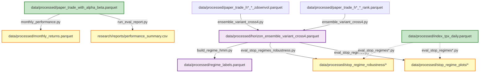

# パイプライン依存図（Parquet入出力）

## 概要

equity01 の scripts/core/ と scripts/analysis/ における parquet ファイルの入出力依存関係を可視化します。

---

## Coreフロー（運用MVP）始点→終点

### Mermaid図（運用フロー完結）

```mermaid
graph TD
    %% === 始点（生データ） ===
    A1[data/raw/jpx_listings/*.csv] -->|universe_builder.py:229| B1[data/intermediate/universe/latest_universe.parquet]
    A2[data/raw/prices/*.csv] -->|build_index_tpx_daily.py:84| B2[data/processed/index_tpx_daily.parquet]
    A3[data/events/calendar.csv] -.->|build_portfolio.py EventGuard| F1
    A4[data/events/earnings.csv] -.->|build_portfolio.py EventGuard| F1
    
    %% === データ準備 ===
    B1 -->|download_prices.py:180| C1[data/raw/prices/prices_{ticker}.csv]
    
    %% === 特徴量構築 ===
    C1 -->|build_features.py:170| D1[data/processed/daily_feature_scores.parquet]
    B2 -.->|build_features.py:71| D1
    
    %% === ポートフォリオ構築（運用終点）===
    D1 -->|build_portfolio.py:63| F1[data/processed/daily_portfolio_guarded.parquet]
    
    %% === 評価パイプライン（運用終点ではない）===
    F1 -.->|calc_alpha_beta.py:165 評価用| G1[data/processed/paper_trade_with_alpha_beta.parquet]
    B2 -.->|calc_alpha_beta.py:27 評価用| G1
    G1 -.->|run_equity01_eval.py:69 評価用| H1[data/processed/rolling_relative_alpha.parquet]
    
    %% スタイル
    classDef inputFile fill:#e1f5ff,stroke:#01579b,stroke-width:2px
    classDef coreEndpoint fill:#ffcdd2,stroke:#c62828,stroke-width:4px
    classDef coreOutput fill:#c8e6c9,stroke:#2e7d32,stroke-width:2px
    classDef evalOutput fill:#fff3e0,stroke:#e65100,stroke-width:1px,stroke-dasharray: 5 5
    
    class A1,A2,A3,A4 inputFile
    class F1 coreEndpoint
    class B1,B2,C1,D1 coreOutput
    class G1,H1 evalOutput
    
    %% ラベル追加
    F1:::coreEndpoint -.- END["★ 運用終点（Executionが読む正本）<br/>weight列必須"]
    G1:::evalOutput -.- EVAL1["評価・分析用（運用終点ではない）"]
    H1:::evalOutput -.- EVAL2["評価・分析用（運用終点ではない）"]
```

---

## Analysisフロー（検証・評価）

### Mermaid図



---

## 完全な依存図（Core + Analysis統合）

### Mermaid図

```mermaid
graph TD
    %% === Coreフロー ===
    subgraph Raw["生データ（Git管理）"]
        A1[data/raw/jpx_listings/*.csv]
        A2[data/raw/prices/*.csv]
        A3[data/events/calendar.csv]
        A4[data/events/earnings.csv]
    end
    
    subgraph Core1["Core: データ準備"]
        B1[data/intermediate/universe/latest_universe.parquet]
        B2[data/processed/index_tpx_daily.parquet]
        C1[data/raw/prices/prices_{ticker}.csv]
    end
    
    subgraph Core2["Core: 特徴量・スコア"]
        D1[data/processed/daily_feature_scores.parquet]
        E1[data/intermediate/scoring/latest_scores.parquet]
    end
    
    subgraph Core3["Core: ポートフォリオ構築（終点）"]
        F1[data/processed/daily_portfolio_guarded.parquet]
    end
    
    subgraph Core4["Core: 評価"]
        G1[data/processed/paper_trade_with_alpha_beta.parquet]
        H1[data/processed/rolling_relative_alpha.parquet]
    end
    
    subgraph Analysis1["Analysis: アンサンブル"]
        J1[data/processed/paper_trade_h*_*_rank.parquet]
        J2[data/processed/paper_trade_h*_*_zdownvol.parquet]
        K1[data/processed/horizon_ensemble_variant_cross4.parquet]
    end
    
    subgraph Analysis2["Analysis: 検証・評価"]
        M1[data/processed/regime_labels.parquet]
        L1[data/processed/stop_regime_plots/*]
        L2[data/processed/stop_regime_robustness/*]
    end
    
    %% エッジ（Core）
    A1 -->|universe_builder.py:229| B1
    A2 -->|build_index_tpx_daily.py:84| B2
    B1 -->|download_prices.py:180| C1
    C1 -->|build_features.py| D1
    B2 -.->|build_features.py| D1
    D1 -.->|run_scoring.py オプション| E1
    D1 -->|build_portfolio.py:63| F1
    A3 -.->|build_portfolio.py EventGuard| F1
    A4 -.->|build_portfolio.py EventGuard| F1
    F1 -.->|calc_alpha_beta.py:165 評価用| G1
    B2 -.->|calc_alpha_beta.py:27 評価用| G1
    G1 -.->|run_equity01_eval.py:69 評価用| H1
    
    %% エッジ（Analysis）
    J1 -->|ensemble_variant_cross4.py| K1
    J2 -->|ensemble_variant_cross4.py| K1
    K1 -->|eval_stop_regimes.py| L1
    K1 -->|eval_stop_regimes_robustness.py| L2
    K1 -->|build_regime_hmm.py:345| M1
    
    %% スタイル
    classDef raw fill:#e1f5ff,stroke:#01579b,stroke-width:2px
    classDef core fill:#c8e6c9,stroke:#2e7d32,stroke-width:3px
    classDef analysis fill:#f3e5f5,stroke:#6a1b9a,stroke-width:2px
    classDef endpoint fill:#ffcdd2,stroke:#c62828,stroke-width:3px
    
    class A1,A2,A3,A4 raw
    class B1,B2,C1,D1,E1,F1,G1,H1 core
    class J1,J2,K1,M1,L1,L2 analysis
    class F1 endpoint
```

---

## ノード詳細（生成元スクリプトと格納先）

### Coreフロー

| Parquetファイル | 生成元スクリプト | 格納先 | 説明 |
|----------------|----------------|--------|------|
| `latest_universe.parquet` | `scripts/core/universe_builder.py:229` | `data/intermediate/universe/` | ユニバース定義 |
| `index_tpx_daily.parquet` | `scripts/tools/build_index_tpx_daily.py:84` | `data/processed/` | TOPIX日次リターン |
| `prices_{ticker}.csv` | `scripts/core/download_prices.py:180` | `data/raw/prices/` | 銘柄別価格データ（CSV） |
| `daily_feature_scores.parquet` | `scripts/core/build_features.py:170` | `data/processed/` | 特徴量 + スコア |
| `daily_portfolio_guarded.parquet` | `scripts/core/build_portfolio.py:63` | `data/processed/` | **ポートフォリオ構築終点（運用終点）** |
| `daily_feature_scores.parquet` | `scripts/core/build_features.py` | `data/processed/` | 特徴量 + スコア |
| `latest_scores.parquet` | `scripts/core/run_scoring.py` | `data/intermediate/scoring/` | スコアリング結果 |
| `daily_portfolio_guarded.parquet` | `scripts/core/build_portfolio.py` | `data/processed/` | **ポートフォリオ構築終点** |
| `paper_trade_with_alpha_beta.parquet` | `scripts/core/calc_alpha_beta.py` | `data/processed/` | ペーパートレード結果 + 相対α |
| `rolling_relative_alpha.parquet` | `scripts/core/run_equity01_eval.py` | `data/processed/` | ローリング相対α |

### Analysisフロー

| Parquetファイル | 生成元スクリプト | 格納先 | 説明 |
|----------------|----------------|--------|------|
| `horizon_ensemble_variant_cross4.parquet` | `scripts/analysis/ensemble_variant_cross4.py` | `data/processed/` | cross4アンサンブル |
| `regime_labels.parquet` | `scripts/core/build_regime_hmm.py` | `data/processed/` | レジームHMMラベル |
| `paper_trade_h*_*_*.parquet` | `scripts/analysis/run_all_*.py` | `data/processed/` | ホライゾン別バックテスト結果 |

---

## 運用終点について

### 運用終点（Executionが読む正本）

**`data/processed/daily_portfolio_guarded.parquet`** が Coreフローの運用終点です。

**生成元:**
- `scripts/core/build_portfolio.py:63` (`df_port.to_parquet(out_path, index=False)`)

**内容:**
- `weight` 列を含み、実運用で直接使用可能
- 最新日（latest date）の行を読み込んで使用

**使用方法:**
- Executionはこのファイルの最新日（latest date）の行を読み込む
- `weight` 列を使用して実運用でのウェイト配分を決定

### 評価・分析用の出力（運用終点ではない）

以下のファイルは評価・分析用であり、運用終点ではありません：

- `data/processed/paper_trade_with_alpha_beta.parquet` - ペーパートレード結果（評価用）
- `data/processed/rolling_relative_alpha.parquet` - ローリング相対α（評価用）

**注意:**
- `run_equity01_eval.py` は「評価」であって終点ではない
- 運用終点は `build_portfolio.py` で生成される `daily_portfolio_guarded.parquet`

### target_weights_latest.parquet について

**現状:**
- `target_weights_latest.parquet` は存在しません
- **Option Aを採用**: `daily_portfolio_guarded.parquet` をそのまま運用終点として使用

**詳細:**
- `docs/target_weights_analysis.md` を参照

---

## 依存関係ルール

### Core → Analysis
- ❌ **禁止**: core側はanalysis側のファイルを読み込まない
- ✅ **許可**: analysis側はcore側のparquetファイルを読み込む

### Core → Tools
- ✅ **許可**: core側はtools側の機能を使用可能

### Analysis → Tools
- ✅ **許可**: analysis側はtools側の機能を使用可能

